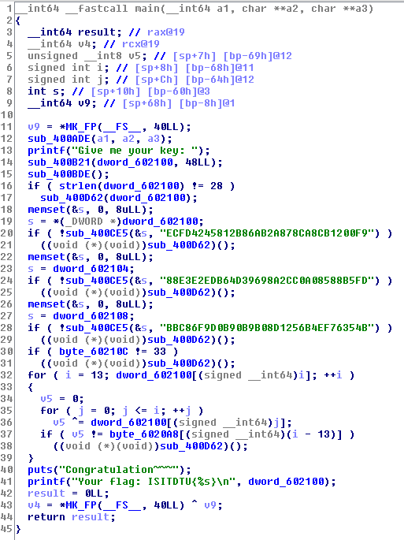
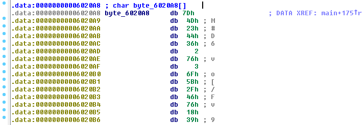

# Cool

Category: `reverse`

File: [cool](files/cool)

Points: `100`

### What It Does

```shell
ubuntu@ubuntu-xenial:/ctf/2018/isitdtu_ctf/reverse$ file cool
cool: ELF 64-bit LSB executable, x86-64, version 1 (SYSV), dynamically linked, interpreter /lib64/ld-linux-x86-64.so.2, for GNU/Linux 2.6.32, BuildID[sha1]=a36ca24ca7c6183e3d50a4c76281a61675a4e875, stripped
ubuntu@ubuntu-xenial:/ctf/2018/isitdtu_ctf/reverse$ 
```

Here is the sample output:

```shell
ubuntu@ubuntu-xenial:/ctf/2018/isitdtu_ctf/reverse$ ./cool 
Give me your key: A
Wrong~
ubuntu@ubuntu-xenial:/ctf/2018/isitdtu_ctf/reverse$ 
```

### How to Solve

Here are some useful strings in the binary:

```shell
ubuntu@ubuntu-xenial:/ctf/2018/isitdtu_ctf/reverse$ strings cool
...
time out!
Error!
Don't trace me~~
Error~
%02X
Wrong~
Give me your key: 
ECFD4245812B86AB2A878CA8CB1200F9
88E3E2EDB64D39698A2CC0A08588B5FD
BBC86F9D0B90B9B08D1256B4EF76354B
Congratulation~~~
Your flag: ISITDTU{%s}
...
ubuntu@ubuntu-xenial:/ctf/2018/isitdtu_ctf/reverse$ 
```

The binary does not let us run it in a debugger, giving us `Don't trace me~~`.

The MD5 hashes can be easily cracked using online MD5 cracker.

```
ECFD4245812B86AB2A878CA8CB1200F9 => fl4g
88E3E2EDB64D39698A2CC0A08588B5FD => _i5_
BBC86F9D0B90B9B08D1256B4EF76354B => h3r3
```

Let's use a disassembler to reverse engineer.

Since the binary is stripped, we have to find the function that prints the flag. In IDA Pro, use `Search > next data` to get the strings, then `Jump > List cross references to...` to jump to the code that calls the string `Your flag: ISITDTU{%s}`. Use `View > Open subviews > Generate pseudocode` to view the pseudocode of the function.



Line `16` shows that the length of the user input is `28`. Lines `20` to `29` show that the user input starts with `fl4g_i5_h3r3`. Line `30` shows that the next character is byte `33` which is `!`.

The user input starts with `fl4g_i5_h3r3!`. We have to reverse lines `32` to `39` to get the rest of the user input.

The code xor each character of the user input up to the current index and compares it against a byte array.

Here is the byte array:



Reverse lines `32` to `39` using the byte array to get the rest of the user input.

Here is the [source code](files/cool_soln.py) of the solution:

```python
#!/bin/python

from pwn import *


def main():
    key = "fl4g_i5_h3r3"
    key += chr(33)

    xor_bytes = [
        0x7D, 0x4D, 0x23, 0x44,
        0x36, 2, 0x76, 3,
        0x6F, 0x5B, 0x2F, 0x46,
        0x76, 0x18, 0x39
    ]

    for b in xor_bytes:
        key_byte = 0

        for c in key:
            key_byte ^= ord(c)

        key += chr(key_byte^b)

    p = process("./cool")
    p.recvuntil("Give me your key: ")
    p.sendline(key)
    data = p.recvrepeat(0.2)

    log.info("Key: {}".format(key))
    log.success(data)

if __name__ == "__main__":
    main()

```

Here is the output:

```shell
ubuntu@ubuntu-xenial:/ctf/2018/isitdtu_ctf/reverse$ python cool_soln.py 
[+] Starting local process './cool': pid 15265
[*] Process './cool' stopped with exit code 0 (pid 15265)
[*] Key: fl4g_i5_h3r3!C0ngr4tul4ti0n!
[+] Congratulation~~~
    Your flag: ISITDTU{fl4g_i5_h3r3!C0ngr4tul4ti0n!}
ubuntu@ubuntu-xenial:/ctf/2018/isitdtu_ctf/reverse$ 
```

**Flag: `ISITDTU{fl4g_i5_h3r3!C0ngr4tul4ti0n!}`**

Files:
- [cool](files/cool)
- [cool_soln.py](files/cool_soln.py)