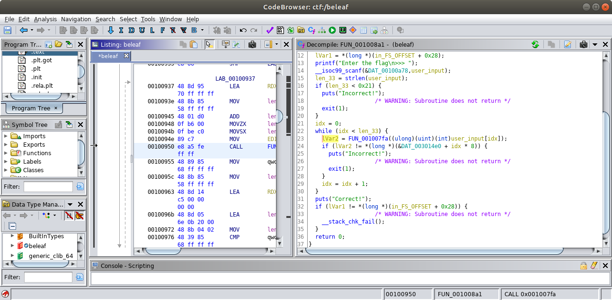
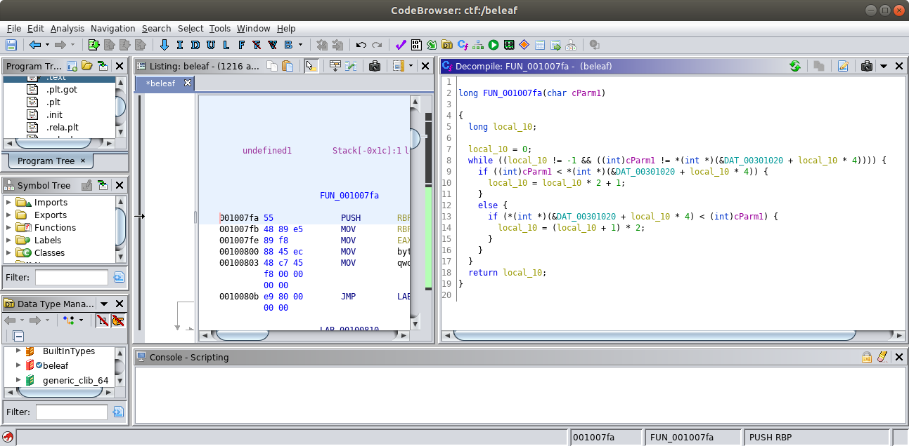

# baby_boi

Category: `rev`

Description: `tree sounds are best listened to by https://binary.ninja/demo or ghidra`

Points: `50`

**Files**
- [beleaf](files/beleaf)

### What It Does

The binary checks whether the user input is the flag.

```shellsession
ubuntu@ubuntu-bionic:/ctf/2019/csaw_ctf_quals/rev$ ./beleaf 
Enter the flag
>>> 123
Incorrect!
ubuntu@ubuntu-bionic:/ctf/2019/csaw_ctf_quals/rev$ 
```

### How to Solve

Searching for the string `Incorrect!`, we get to the main function.



Line 16 checks whether the input has a length of `0x21`, which is `33`. Line 22 to 29 checks whether each return value of the function call `FUN_001007fa`, given a character of the input, matches the value of the array `DAT_003014e0` at `idx * 8`.



The function compares the input character with the character set `DAT_00301020` and returns the position or `-1` if the input character is not within the character set `DAT_00301020`. Hence, the array `DAT_003014e0` is the character positions in the character set.

The byte string of the character positions array `DAT_003014e0` without spaces:

```
010000000000000009000000000000001100000000000000270000000000000002000000000000000000000000000000120000000000000003000000000000000800000000000000120000000000000009000000000000001200000000000000110000000000000001000000000000000300000000000000130000000000000004000000000000000300000000000000050000000000000015000000000000002e000000000000000a0000000000000003000000000000000a000000000000001200000000000000030000000000000001000000000000002e0000000000000016000000000000002e000000000000000a0000000000000012000000000000000600000000000000
```

We can parse it so that it only returns an int array of the character positions.

```python
[int(DAT_003014e0[idx:idx+2], 16) for idx in xrange(0, len(DAT_003014e0), 16)]
```

The byte string of the character set `DAT_00301020` without spaces:

```
77000000660000007b0000005f0000006e000000790000007d000000ffffffff620000006c00000072000000ffffffffffffffffffffffffffffffffffffffffffffffff610000006500000069000000ffffffff6f00000074000000ffffffffffffffffffffffffffffffffffffffffffffffffffffffffffffffffffffffffffffffffffffffffffffffffffffffffffffffffffffffffffffffff67000000ffffffffffffffffffffffffffffffffffffffffffffffff75000000ffffffffffffffffffffffffffffffffffffffffffffffffffffffffffffffffffffffffffffffffffffffffffffffffffffffffffffffffffffffffffffffffffffffffffffffffffffffffffffffffffffffffffffffffffffffffffffffffffffffffffffffffffffffffffffffffffffffffffffffffffffffffffffffffffffffffffffffffffffffffffffffffffffffffffffffffffffffffffffffffffffffffffffffffffffffffffffffffffffffffffffffffffffffffffffffffffffffffffffffffffffffffffffffffffffffffffffffffffffffffffffffffffffffffffffffffffffffffffffffffffffffffffffffffffffffffffffffffffffffffffffffffffffffffffffffffffffffffffffffffffffffffffffffffffffffffffffffffffffffffffffffffffffffffffffffffffffffffffffffffffffffffffffffffffffffffffffffffffffffffffffffffffffffffffffffffffffffffffffffffffffffffffffffffffffffffffffffffffffffffffffffffffffffffffffffffffffffffffffffffffffffffffffffffffffffffffffffffffffffffffffffffffffffffffffffffffffffffffffffffffffffffffffffffffffffffffffffffffffffffffffffffffffffffffffffffffffffffffffffffffffffffffffffffffffffffffffffffffffffffffffffffffffffffffffffffffffffffffffffffffffffffffffffffffffffffffffffffffffffffffffffffffffffffffffffffffffffffffffffffffffffffffffffffffffffffffffffffffffffffffffffffffffffffffffffffffffffffffffffffffffffffffffffffffffffffffffffffffffffffffffffffffffffffffffffffffffffffffffffffffffffffffffffffffffffffffffffffffffffffffffffffffffffffffffffffffffffffffffffffffffffffffffffffffffffffffffffffffffffffffffffffffffffffffffffffffffffffffffffffffffffffffffffffffffffffffffffffffffffffffffffffffffffffffffffffffffffffffffffffffffffffffffffffffffffffffffffffffffffffffffffffffffffffffffffffffffffffffffffffffffffffffffffffffffffffffffffffffffffffffffffffffffffffffffffffffffffffffffffffffffffffffffffffffffffffffffffffffffffffffffffffffffffffffffffffffffffffffffffffffffffffffffffffffffffffffffffffffffffffffffffffffffffffffffffffffffffffffffffffffffffffffffffffffffffffffffffffffffffffffffffffffffffffffffffffffffffffffffffffffffffffffffffffffffffffffffffffffffffffffffffffffffffffffffffffffffffffffffffffffffffffffffffffffffffff00000000000000000000000000000000
```

We can parse it so that it only returns a character array of the character set.

```python
[DAT_00301020[idx:idx+2].decode("hex") for idx in xrange(0, len(DAT_00301020), 8)]
```

To get the flag, we loop through the character positions array `DAT_003014e0` to get the character from the character set.

```python
#!/bin/python

def read_file(filename):
    with open(filename) as f:
        contents = f.read()

    return contents


def parse_char_positions(data):
    return [int(data[idx:idx+2], 16) for idx in xrange(0, len(data), 16)]


def parse_charset(data):
    return [data[idx:idx+2].decode("hex") for idx in xrange(0, len(data), 8)]


def main():
    dat_003014e0 = read_file("dat_003014e0.txt")
    char_positions = parse_char_positions(dat_003014e0)
    dat_00301020 = read_file("dat_00301020.txt")
    charset = parse_charset(dat_00301020)
    flag = []

    for char_position in char_positions:
        flag.append(charset[char_position])

    print "".join(flag)


if __name__ == "__main__":
    main()
```

Print the flag and test it against the binary.

```shellsession
ubuntu@ubuntu-bionic:/ctf/2019/csaw_ctf_quals/rev$ ./beleaf 
Enter the flag
>>> flag{we_beleaf_in_your_re_future}
Correct!
ubuntu@ubuntu-bionic:/ctf/2019/csaw_ctf_quals/rev$ python beleaf_soln.py | ./beleaf 
Enter the flag
>>> Correct!
ubuntu@ubuntu-bionic:/ctf/2019/csaw_ctf_quals/rev$ 
```

**Flag: `flag{we_beleaf_in_your_re_future}`**

**Files**
- [dat_003014e0.txt](files/dat_003014e0.txt)
- [dat_00301020.txt](files/dat_00301020.txt)
- [beleaf_soln.py](files/beleaf_soln.py)